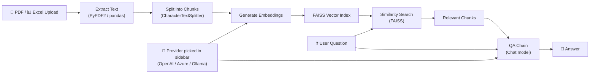
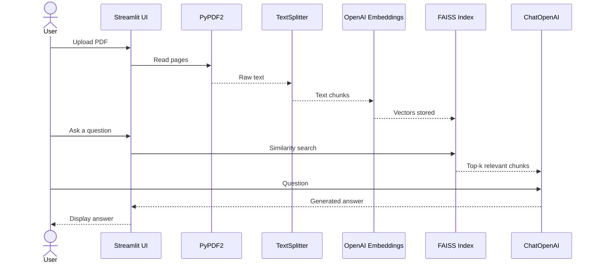
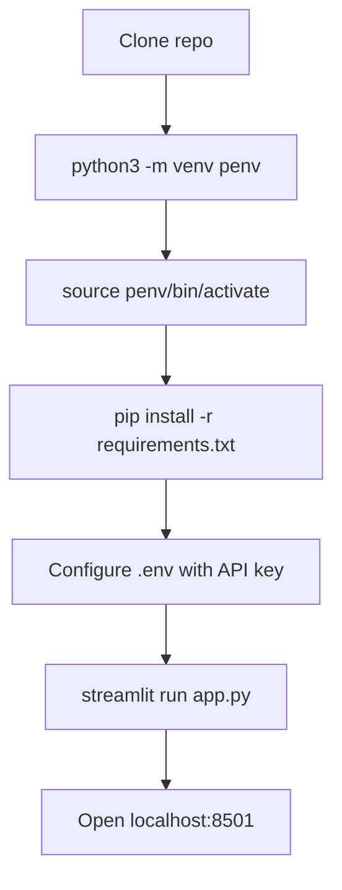

# Ask PDF Demo

Upload a PDF or Excel (`.xlsx`) file and ask questions about its content using **LangChain**, with your choice of **OpenAI**, **Azure OpenAI / AI Foundry**, or a **local Ollama** model.

For details about using this service, see [details.md](details.md).

---

## Architecture


```mermaid
flowchart LR
    A["📄 PDF / 📊 Excel Upload"] --> B["Extract Text\n(PyPDF2 / pandas)"]
    B --> C["Split into Chunks\n(CharacterTextSplitter)"]
    P["🔀 Provider picked in sidebar\n(OpenAI / Azure / Ollama)"] --> D
    C --> D["Generate Embeddings"]
    D --> E["FAISS Vector Index"]
    F["❓ User Question"] --> G["Similarity Search\n(FAISS)"]
    E --> G
    G --> H["Relevant Chunks"]
    P --> I
    H --> I["QA Chain\n(Chat model)"]
    F --> I
    I --> J["💬 Answer"]
```

### Step-by-step


```mermaid
sequenceDiagram
    actor User
    participant UI as Streamlit UI
    participant PDF as PyPDF2
    participant Split as TextSplitter
    participant Emb as OpenAI Embeddings
    participant FAISS as FAISS Index
    participant LLM as ChatOpenAI

    User->>UI: Upload PDF
    UI->>PDF: Read pages
    PDF-->>Split: Raw text
    Split-->>Emb: Text chunks
    Emb-->>FAISS: Vectors stored

    User->>UI: Ask a question
    UI->>FAISS: Similarity search
    FAISS-->>LLM: Top-k relevant chunks
    User->>LLM: Question
    LLM-->>UI: Generated answer
    UI-->>User: Display answer
```

---

## Tech Stack

| Component | Package | Purpose |
|---|---|---|
| LLM (OpenAI) | `langchain-openai` (`ChatOpenAI`) | Chat-based completions via **gpt-4o-mini** |
| LLM (Azure) | `langchain-openai` (`AzureChatOpenAI`) | Chat completions via an Azure OpenAI / AI Foundry deployment |
| LLM (local) | `langchain-ollama` (`OllamaLLM`) | Chat completions from a locally-running open model |
| Embeddings | `langchain-openai` / `langchain-ollama` (`OpenAIEmbeddings`, `AzureOpenAIEmbeddings`, `OllamaEmbeddings`) | Convert text chunks to vectors — one class per provider |
| Vector Store | `langchain-community` (`FAISS`) | Fast nearest-neighbour similarity search |
| Text Splitting | `langchain-text-splitters` | Chunk documents with overlap (scaled to file size) |
| PDF Parsing | `PyPDF2` | Extract text from uploaded PDFs |
| Excel Parsing | `pandas` + `openpyxl` | Extract every sheet of an uploaded `.xlsx` as text |
| Web UI | `Streamlit` | Interactive front-end, including the provider picker sidebar |

> **Note:** The codebase uses the **modular LangChain ≥ 0.3** packages (`langchain-openai`, `langchain-community`, `langchain-text-splitters`, `langchain-ollama`) instead of the legacy monolithic `langchain` package.

---

## LLM Providers

Pick a provider from the sidebar when the app is running — each one needs its own settings, pre-filled from `.env` (see [.env.sample](.env.sample)) but editable at runtime:

| Provider | Needs | Notes |
|---|---|---|
| **OpenAI (cloud)** | `OPENAI_API_KEY` | Default; `gpt-4o-mini` for chat, OpenAI's embedding model |
| **Azure OpenAI / AI Foundry** | `AZURE_OPENAI_API_KEY`, `AZURE_OPENAI_ENDPOINT`, `AZURE_OPENAI_API_VERSION`, `AZURE_OPENAI_LLM_DEPLOYMENT`, `AZURE_OPENAI_EMBEDDING_DEPLOYMENT` | Deployment names are resource-specific — set them up in Azure AI Foundry first |
| **Ollama (local)** | A running `ollama serve` + models pulled locally (`ollama pull llama3`, `ollama pull nomic-embed-text`) | No API key or internet access needed; runs fully offline |

### Using Ollama from Docker

`OLLAMA_BASE_URL` defaults to `http://localhost:11434`, which is correct when running `streamlit run app.py` directly. **It will not work from inside the Docker container** — `localhost` there means the container itself, not your host machine, so the app can't reach Ollama and (before this was fixed) the page would show a connection-error crash.

If you're running via `make run` / Docker:

1. Set `OLLAMA_BASE_URL=http://host.docker.internal:11434` in `.env`, or type it directly into the "Ollama server URL" sidebar field (it has a `?` hint reminding you of this).
2. Make sure `ollama serve` is running on your host and the model(s) are pulled.
3. `make run`'s `docker run` already passes `--add-host=host.docker.internal:host-gateway`, so `host.docker.internal` resolves correctly on both Docker Desktop (Mac/Windows) and plain Linux Docker Engine ≥ 20.10 (the classroom/cloud-VM deployment path).

A bad or unreachable Ollama URL now fails fast with a clear `st.error()` message (including this same hint) instead of an unhandled crash — see `describe_provider_error()` in `app.py`.

#### On a Linux / cloud VM (e.g. Azure), a "timed out" error means something different than on Mac

If the error says `timed out` rather than "refused"/"failed to connect", `host.docker.internal` *did* resolve, but nothing answered. This is a different bug than the one above: **Ollama on Linux binds to `127.0.0.1` by default**, which containers can never reach regardless of hostname/networking tricks. Docker Desktop on Mac papers over this; plain Linux Docker Engine does not.

Fix, on the VM itself (not in this repo):

```bash
sudo systemctl edit ollama
```

Add, then save:

```ini
[Service]
Environment="OLLAMA_HOST=0.0.0.0:11434"
```

```bash
sudo systemctl daemon-reload
sudo systemctl restart ollama
```

(No systemd service? Run it manually as `OLLAMA_HOST=0.0.0.0:11434 ollama serve` instead.)

If it's still timing out after that, a host firewall (`ufw`/`iptables`) may be dropping traffic to port 11434 from Docker's bridge subnet — check `sudo ufw status` / `sudo iptables -L`. Azure's Network Security Group doesn't apply here; this traffic never leaves the VM.

**Security note:** `OLLAMA_HOST=0.0.0.0` makes Ollama reachable from anywhere that can reach the VM on port 11434, not just Docker — make sure your cloud firewall/NSG doesn't expose that port to the internet. A tighter alternative is binding to just the Docker bridge gateway IP (`ip addr show docker0`, typically `172.17.0.1`) instead of `0.0.0.0`.

#### PDF works but a large Excel file still times out — that's a third, different cause

Once networking is fixed (above), a `timed out` error that only happens on **large `.xlsx` files** (not small PDFs) isn't a networking problem at all: `OllamaEmbeddings.embed_documents()` sends **every chunk in one single batched request**, and embedding a few hundred chunks from an 800-row spreadsheet on **CPU-only hardware** (no GPU, common on cloud VMs) can legitimately take minutes. A small PDF has far fewer chunks and finishes fast; a big spreadsheet doesn't.

The app already waits up to 5 minutes per request for Ollama and shows a spinner while it works (previously 30s, which was fine for PDFs but too short for large spreadsheets) — `describe_provider_error()` in `app.py` tells this case apart from a real networking failure by checking whether the initial reachability probe succeeded. If 5 minutes still isn't enough on your VM, try a smaller file, confirm nothing else is using the Ollama server at the same time (`ollama ps`), or check the VM's CPU/RAM usage while it runs.

---

## Prerequisites

- Python 3.10+
- An [OpenAI API key](https://platform.openai.com/account/api-keys)

---

## Quick Start (local)

1. **Clone the repo**

```bash
git clone https://github.com/iportilla/ask-pdf.git
cd ask-pdf
```

2. **Create a virtual environment** (`penv`) and activate it

```bash
python3 -m venv penv
source penv/bin/activate      # macOS / Linux
# penv\Scripts\activate       # Windows
```

3. **Install dependencies** inside the venv

```bash
pip install --upgrade pip
pip install -r requirements.txt
```

4. **Create a `.env` file** with your provider credentials

```bash
cp .env.sample .env
# then edit .env -- fill in the block for whichever provider(s) you'll use
OPENAI_API_KEY="sk-..."
```

5. **Run the app**

```bash
streamlit run app.py
```

6. Open the URL shown in your terminal (usually `http://localhost:8501`).

> **Tip:** To deactivate the virtual environment later, run `deactivate`.


```mermaid
flowchart TD
    A["Clone repo"] --> B["python3 -m venv penv"]
    B --> C["source penv/bin/activate"]
    C --> D["pip install -r requirements.txt"]
    D --> E["Configure .env with API key"]
    E --> F["streamlit run app.py"]
    F --> G["Open localhost:8501"]
```

---

## Docker / Cloud VM Deployment

1. **Connect to the VM**

```bash
ssh ubuntu@XX.XXX.XXX.XXX
```

2. **Clone & configure** (same steps as above)

3. **Update the port** in the `Makefile` if needed

```bash
vi Makefile
export PORT ?= 81   # pick a port in 80–90
```

4. **Build & run**

```bash
make clean
make build
make run
```

> `make build` takes roughly 4–5 minutes on a small instance.

5. Open `http://XX.XXX.XXX.XXX:PORT` in a browser.

---

## Usage

1. Pick an **LLM Provider** in the sidebar (OpenAI, Azure OpenAI / AI Foundry, or Ollama) — see [LLM Providers](#llm-providers) above.
2. Click **"Upload your PDF or Excel file"** — `.pdf` and `.xlsx` are both supported (you can use the [US Constitution](docs/constitution.pdf) provided in `docs/`, or see [docs/excel-users-guide.md](docs/excel-users-guide.md) for spreadsheet examples).
3. Ask a question, e.g. *"Who can be a representative?"*


