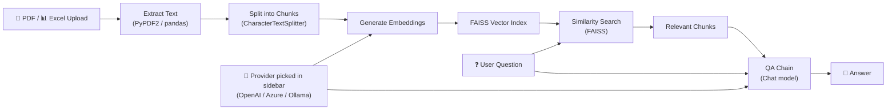
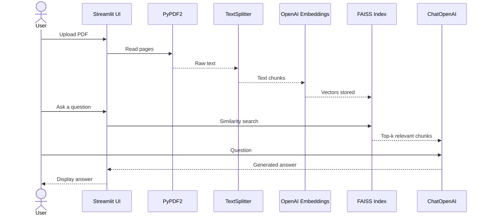
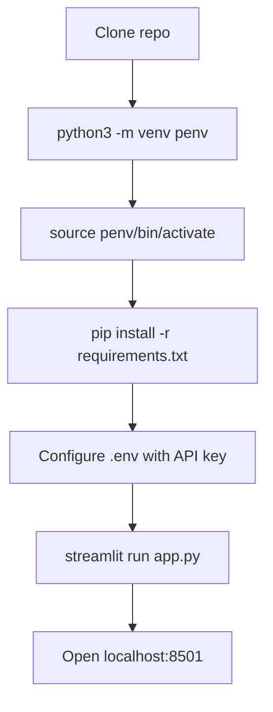

# Ask PDF Demo

Upload a PDF or Excel (`.xlsx`) file and ask questions about its content using **LangChain**, with your choice of **OpenAI**, **Azure OpenAI / AI Foundry**, or a **local Ollama** model.

For details about using this service, see [details.md](details.md).

---

## Architecture


```mermaid
flowchart LR
    A["📄 PDF / 📊 Excel Upload"] --> B["Extract Text\n(PyPDF2 / pandas)"]
    B --> C["Split into Chunks\n(CharacterTextSplitter)"]
    P["🔀 Provider picked in sidebar\n(OpenAI / Azure / Ollama)"] --> D
    C --> D["Generate Embeddings"]
    D --> E["FAISS Vector Index"]
    F["❓ User Question"] --> G["Similarity Search\n(FAISS)"]
    E --> G
    G --> H["Relevant Chunks"]
    P --> I
    H --> I["QA Chain\n(Chat model)"]
    F --> I
    I --> J["💬 Answer"]
```

### Step-by-step


```mermaid
sequenceDiagram
    actor User
    participant UI as Streamlit UI
    participant PDF as PyPDF2
    participant Split as TextSplitter
    participant Emb as OpenAI Embeddings
    participant FAISS as FAISS Index
    participant LLM as ChatOpenAI

    User->>UI: Upload PDF
    UI->>PDF: Read pages
    PDF-->>Split: Raw text
    Split-->>Emb: Text chunks
    Emb-->>FAISS: Vectors stored

    User->>UI: Ask a question
    UI->>FAISS: Similarity search
    FAISS-->>LLM: Top-k relevant chunks
    User->>LLM: Question
    LLM-->>UI: Generated answer
    UI-->>User: Display answer
```

---

## Tech Stack

| Component | Package | Purpose |
|---|---|---|
| LLM (OpenAI) | `langchain-openai` (`ChatOpenAI`) | Chat-based completions via **gpt-4o-mini** |
| LLM (Azure) | `langchain-openai` (`AzureChatOpenAI`) | Chat completions via an Azure OpenAI / AI Foundry deployment |
| LLM (local) | `langchain-ollama` (`OllamaLLM`) | Chat completions from a locally-running open model |
| Embeddings | `langchain-openai` / `langchain-ollama` (`OpenAIEmbeddings`, `AzureOpenAIEmbeddings`, `OllamaEmbeddings`) | Convert text chunks to vectors — one class per provider |
| Vector Store | `langchain-community` (`FAISS`) | Fast nearest-neighbour similarity search |
| Text Splitting | `langchain-text-splitters` | Chunk documents with overlap (scaled to file size) |
| PDF Parsing | `PyPDF2` | Extract text from uploaded PDFs |
| Excel Parsing | `pandas` + `openpyxl` | Extract every sheet of an uploaded `.xlsx` as text |
| Web UI | `Streamlit` | Interactive front-end, including the provider picker sidebar |

> **Note:** The codebase uses the **modular LangChain ≥ 0.3** packages (`langchain-openai`, `langchain-community`, `langchain-text-splitters`, `langchain-ollama`) instead of the legacy monolithic `langchain` package.

---

## LLM Providers

Pick a provider from the sidebar when the app is running — each one needs its own settings, pre-filled from `.env` (see [.env.sample](.env.sample)) but editable at runtime:

| Provider | Needs | Notes |
|---|---|---|
| **OpenAI (cloud)** | `OPENAI_API_KEY` | Default; `gpt-4o-mini` for chat, OpenAI's embedding model |
| **Azure OpenAI / AI Foundry** | `AZURE_OPENAI_API_KEY`, `AZURE_OPENAI_ENDPOINT`, `AZURE_OPENAI_API_VERSION`, `AZURE_OPENAI_LLM_DEPLOYMENT`, `AZURE_OPENAI_EMBEDDING_DEPLOYMENT` | Deployment names are resource-specific — set them up in Azure AI Foundry first |
| **Ollama (local)** | A running `ollama serve` + models pulled locally (`ollama pull llama3`, `ollama pull nomic-embed-text`) | No API key or internet access needed; runs fully offline |

---

## Prerequisites

- Python 3.10+
- An [OpenAI API key](https://platform.openai.com/account/api-keys)

---

## Quick Start (local)

1. **Clone the repo**

```bash
git clone https://github.com/iportilla/ask-pdf.git
cd ask-pdf
```

2. **Create a virtual environment** (`penv`) and activate it

```bash
python3 -m venv penv
source penv/bin/activate      # macOS / Linux
# penv\Scripts\activate       # Windows
```

3. **Install dependencies** inside the venv

```bash
pip install --upgrade pip
pip install -r requirements.txt
```

4. **Create a `.env` file** with your provider credentials

```bash
cp .env.sample .env
# then edit .env -- fill in the block for whichever provider(s) you'll use
OPENAI_API_KEY="sk-..."
```

5. **Run the app**

```bash
streamlit run app.py
```

6. Open the URL shown in your terminal (usually `http://localhost:8501`).

> **Tip:** To deactivate the virtual environment later, run `deactivate`.


```mermaid
flowchart TD
    A["Clone repo"] --> B["python3 -m venv penv"]
    B --> C["source penv/bin/activate"]
    C --> D["pip install -r requirements.txt"]
    D --> E["Configure .env with API key"]
    E --> F["streamlit run app.py"]
    F --> G["Open localhost:8501"]
```

---

## Docker / Cloud VM Deployment

1. **Connect to the VM**

```bash
ssh ubuntu@XX.XXX.XXX.XXX
```

2. **Clone & configure** (same steps as above)

3. **Update the port** in the `Makefile` if needed

```bash
vi Makefile
export PORT ?= 81   # pick a port in 80–90
```

4. **Build & run**

```bash
make clean
make build
make run
```

> `make build` takes roughly 4–5 minutes on a small instance.

5. Open `http://XX.XXX.XXX.XXX:PORT` in a browser.

---

## Usage

1. Pick an **LLM Provider** in the sidebar (OpenAI, Azure OpenAI / AI Foundry, or Ollama) — see [LLM Providers](#llm-providers) above.
2. Click **"Upload your PDF or Excel file"** — `.pdf` and `.xlsx` are both supported (you can use the [US Constitution](docs/constitution.pdf) provided in `docs/`, or see [docs/excel-users-guide.md](docs/excel-users-guide.md) for spreadsheet examples).
3. Ask a question, e.g. *"Who can be a representative?"*


