# Ask PDF Demo

Upload a PDF and ask questions about its content using **OpenAI** and **LangChain**.

For details about using this service, see [details.md](details.md).

---

## Architecture

```mermaid
flowchart LR
    A["📄 PDF Upload"] --> B["Extract Text\n(PyPDF2)"]
    B --> C["Split into Chunks\n(CharacterTextSplitter)"]
    C --> D["Generate Embeddings\n(OpenAI)"]
    D --> E["FAISS Vector Index"]
    F["❓ User Question"] --> G["Similarity Search\n(FAISS)"]
    E --> G
    G --> H["Relevant Chunks"]
    H --> I["QA Chain\n(ChatOpenAI · gpt-4o-mini)"]
    F --> I
    I --> J["💬 Answer"]
```



### Step-by-step


---

## Tech Stack

| Component | Package | Purpose |
|---|---|---|
| LLM | `langchain-openai` (`ChatOpenAI`) | Chat-based completions via **gpt-4o-mini** |
| Embeddings | `langchain-openai` (`OpenAIEmbeddings`) | Convert text chunks to vectors |
| Vector Store | `langchain-community` (`FAISS`) | Fast nearest-neighbour similarity search |
| Text Splitting | `langchain-text-splitters` | Chunk documents with overlap |
| PDF Parsing | `PyPDF2` | Extract text from uploaded PDFs |
| Web UI | `Streamlit` | Interactive front-end |

> **Note:** The codebase uses the **modular LangChain ≥ 0.3** packages (`langchain-openai`, `langchain-community`, `langchain-text-splitters`) instead of the legacy monolithic `langchain` package.

---

## Prerequisites

- Python 3.10+
- An [OpenAI API key](https://platform.openai.com/account/api-keys)

---

## Quick Start (local)

1. **Clone the repo**

```bash
git clone https://github.com/iportilla/ask-pdf.git
cd ask-pdf
```

2. **Create a virtual environment** (`penv`) and activate it

```bash
python3 -m venv penv
source penv/bin/activate      # macOS / Linux
# penv\Scripts\activate       # Windows
```

3. **Install dependencies** inside the venv

```bash
pip install --upgrade pip
pip install -r requirements.txt
```

4. **Create a `.env` file** with your OpenAI key

```bash
cp .env.sample .env
# then edit .env
OPENAI_API_KEY="sk-..."
```

5. **Run the app**

```bash
streamlit run app.py
```

6. Open the URL shown in your terminal (usually `http://localhost:8501`).

> **Tip:** To deactivate the virtual environment later, run `deactivate`.


---

## Docker / Cloud VM Deployment

1. **Connect to the VM**

```bash
ssh ubuntu@XX.XXX.XXX.XXX
```

2. **Clone & configure** (same steps as above)

3. **Update the port** in the `Makefile` if needed

```bash
vi Makefile
export PORT ?= 81   # pick a port in 80–90
```

4. **Build & run**

```bash
make clean
make build
make run
```

> `make build` takes roughly 4–5 minutes on a small instance.

5. Open `http://XX.XXX.XXX.XXX:PORT` in a browser.

---

## Usage

1. Click **"Upload your PDF"** (you can use the [US Constitution](docs/constitution.pdf) provided in `docs/`).
2. Ask a question, e.g. *"Who can be a representative?"*


