# LangChain Ask PDF

> You may find the step-by-step video tutorial to build this application [on Youtube](https://youtu.be/wUAUdEw5oxM) and corresponding [GitHub repository](https://github.com/alejandro-ao/langchain-ask-pdf).


This is a Python application that allows you to load a PDF and ask questions about it using natural language. The application uses an LLM to generate a response about your PDF. The LLM will not answer questions unrelated to the document.

---

## How it works

The application reads the PDF and splits the text into smaller, overlapping chunks. It uses **OpenAI embeddings** to create vector representations of the chunks and stores them in a **FAISS** index. When the user asks a question, the application finds the most semantically similar chunks via cosine similarity and feeds them — along with the question — into **ChatOpenAI** (`gpt-4o-mini`) to generate an answer.

```mermaid
flowchart TD
    subgraph Ingestion
        A["📄 Upload PDF"] --> B["Extract text\n(PyPDF2 · PdfReader)"]
        B --> C["Split into overlapping chunks\n(CharacterTextSplitter\nchunk_size=1000, overlap=200)"]
        C --> D["Generate embeddings\n(OpenAIEmbeddings)"]
        D --> E[("FAISS Vector Index")]
    end

    subgraph Query
        F["❓ User question"] --> G["Similarity search\n(knowledge_base.similarity_search)"]
        E --> G
        G --> H["Top-k relevant chunks"]
        H --> I["QA 'stuff' chain\n(ChatOpenAI · gpt-4o-mini)"]
        F --> I
        I --> J["💬 Answer displayed\n(st.write)"]
    end
```



The application uses **Streamlit** for the web UI and the **modular LangChain ≥ 0.3** ecosystem to orchestrate the LLM pipeline.

---

## Installation

1. Clone the repository and create a virtual environment:

```bash
git clone https://github.com/iportilla/ask-pdf.git
cd ask-pdf
python3 -m venv penv
source penv/bin/activate   # macOS / Linux
```

2. Install dependencies:

```bash
pip install --upgrade pip
pip install -r requirements.txt
```

3. Add your OpenAI API key to a `.env` file:

```bash
cp .env.sample .env
# edit .env → OPENAI_API_KEY="sk-..."
```

## Usage

Run the app with Streamlit:

```bash
streamlit run app.py
```

---

## Code Analysis

### Imports & packages

The app uses the **modular LangChain 0.3** packages instead of the legacy monolithic `langchain`:

| Import | Package | Role |
|---|---|---|
| `ChatOpenAI` | `langchain-openai` | Chat-based LLM (gpt-4o-mini) |
| `OpenAIEmbeddings` | `langchain-openai` | Text → vector embeddings |
| `FAISS` | `langchain-community` | In-memory vector store |
| `CharacterTextSplitter` | `langchain-text-splitters` | Chunk long documents |
| `load_qa_chain` | `langchain` | Pre-built QA chain (stuff strategy) |
| `get_openai_callback` | `langchain-community` | Token-usage tracking |

### Inputs

No direct inputs to `main()`. The function relies on the user uploading a PDF file and providing a question via the Streamlit UI.

---

### Flow


1. Load environment variables using `load_dotenv()`.
2. Configure the Streamlit page (`set_page_config`, `header`).
3. Prompt the user to upload a PDF via `st.file_uploader()`.
4. Extract text from every page using `PdfReader` and `page.extract_text()`.
5. Concatenate all page text into a single string.
6. Split text into overlapping chunks with `CharacterTextSplitter` (chunk size 1000, overlap 200).
7. Create embeddings with `OpenAIEmbeddings` and build a FAISS index via `FAISS.from_texts()`.
8. Prompt the user for a question via `st.text_input()`.
9. Perform similarity search on the knowledge base to find the most relevant chunks.
10. Instantiate `ChatOpenAI(model="gpt-4o-mini", temperature=0)` and load the QA "stuff" chain.
11. Run the chain with `chain.invoke()`, passing `input_documents` and `question`.
12. Token usage is tracked via `get_openai_callback()` and printed to the console.
13. Display the response with `st.write()`.

---

### Outputs

The function has no return value. The answer to the user's question is displayed in the Streamlit UI via `st.write()`, and token-usage metrics are printed to the console.

---

## Key Libraries

### LangChain

[LangChain](https://python.langchain.com/docs/get_started/introduction) is a framework for developing applications powered by language models. As of v0.3 it is split into modular packages (`langchain-openai`, `langchain-community`, `langchain-text-splitters`, etc.) for better dependency management.

### FAISS

[FAISS](https://faiss.ai/index.html) (Facebook AI Similarity Search) is a library for efficient similarity search and clustering of dense vectors. In this app it provides an in-memory vector index that enables fast cosine-similarity lookups over the document chunks.

### Detailed walkthrough

#### Embeddings & vector index (steps 6–7)

`OpenAIEmbeddings` is a pre-trained sentence-encoder model that maps text to high-dimensional vectors. `FAISS.from_texts()` takes the list of text chunks and the embedding model, encodes every chunk, and builds an index for nearest-neighbour search. The resulting `knowledge_base` object supports `similarity_search()` to retrieve the most relevant chunks for any query.

#### QA chain (steps 10–12)

`ChatOpenAI` connects to the **Chat Completions API** (`gpt-4o-mini`). `load_qa_chain(llm, chain_type="stuff")` creates a pipeline that concatenates ("stuffs") the retrieved documents into the prompt alongside the user's question and asks the model for an answer. This strategy works best when the total context is small enough to fit in a single prompt.

`chain.invoke()` runs the pipeline and returns a dictionary. The answer is in `response["output_text"]`.

The `get_openai_callback()` context manager captures API metrics (tokens used, cost) during the call. `print(cb)` logs them to the console for monitoring.

---

## Contributing

This repository is for educational purposes only and is not intended to receive further contributions. It is supposed to be used as support material for the YouTube tutorial that shows how to build the project.

See [GitHub Copilot](https://github.com/features/copilot) to learn how to chat with your code.


