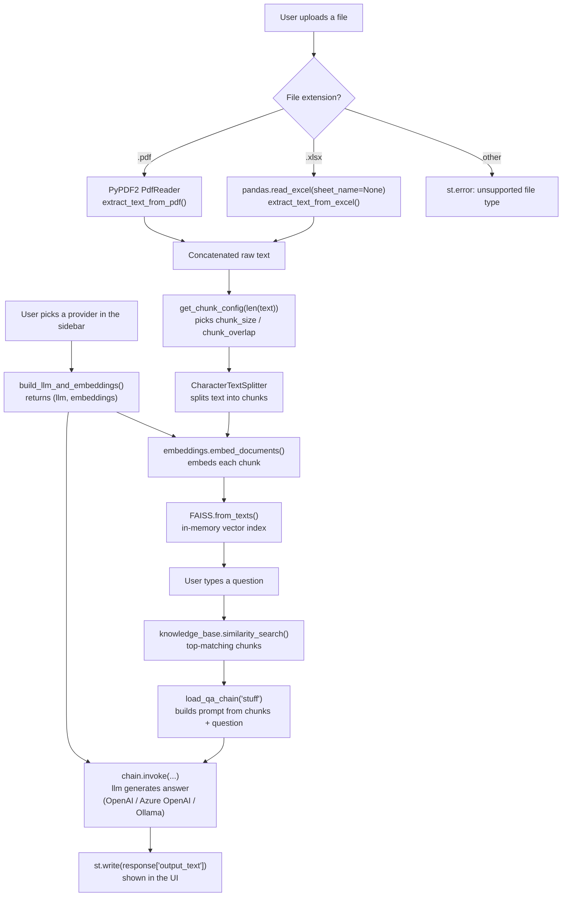
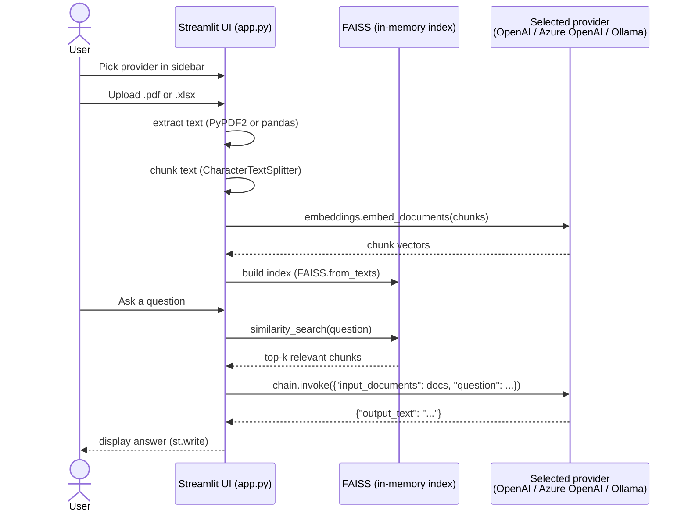
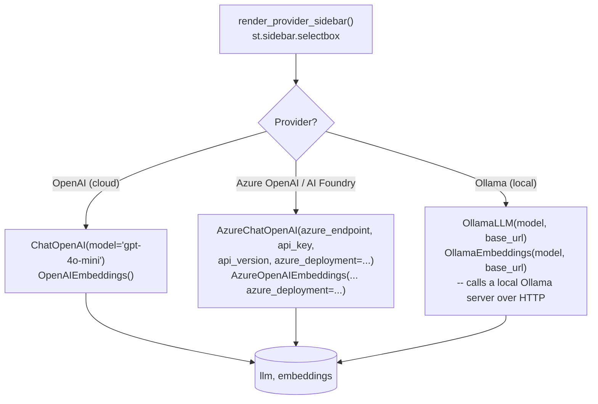
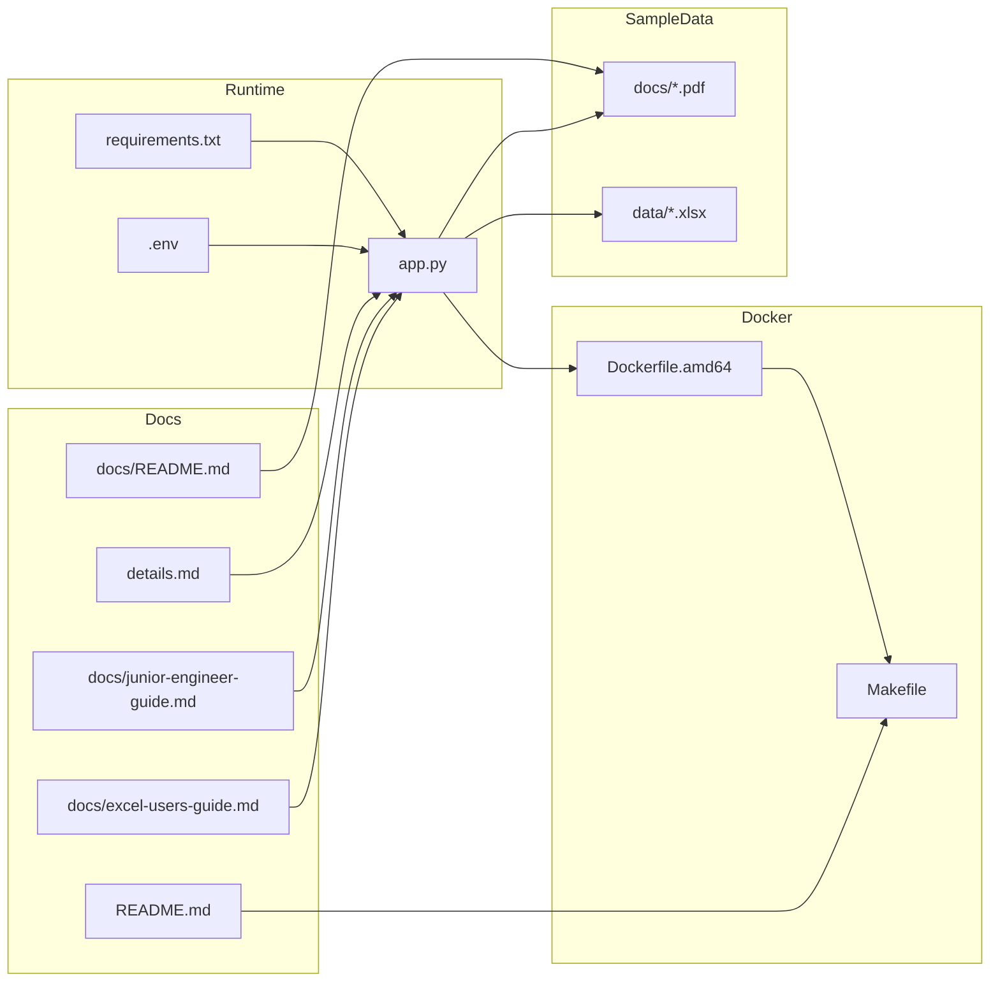

# Ask PDF — Junior Engineer Guide

> **Repo:** `ask-pdf` (GitHub: `iportilla/ask-pdf`)
> **Purpose of this document:** a self-contained reference for a junior engineer (or an AI/RAG assistant) trying to understand, run, or modify this repository, without needing to read every file first. Each section below is written to stand on its own.

## 1. What this repo is

`ask-pdf` is a small **Streamlit web application** that lets a user **upload a PDF or Excel (`.xlsx`) file and ask questions about it in plain English**. It answers using **retrieval-augmented generation (RAG)**: the app embeds the document's text, stores it in a local vector index, retrieves the most relevant chunks for a question, and sends those chunks plus the question to a language model to generate an answer.

The LLM/embeddings backend is **pluggable via a sidebar picker** (see `render_provider_sidebar()` / `build_llm_and_embeddings()` in [app.py](../app.py)) — the user chooses one of three providers per session:

- **OpenAI (cloud)** — the default path, `ChatOpenAI(model="gpt-4o-mini")` + `OpenAIEmbeddings()`.
- **Azure OpenAI / AI Foundry** — `AzureChatOpenAI` + `AzureOpenAIEmbeddings` (both from `langchain-openai`), pointed at an Azure-hosted deployment.
- **Ollama (local)** — a locally-run open model (e.g. Llama 3) served by [Ollama](https://ollama.com), via `OllamaLLM` + `OllamaEmbeddings` from the `langchain-ollama` package. No API key, no cloud cost, works offline.

It is a classroom/demo project (see `README.md` for AWS/Azure classroom deployment steps), not a production service. There is no authentication, no persistence between sessions, and no multi-user support beyond what Streamlit itself provides.

**Keywords for search:** PDF question answering, Excel question answering, chat with PDF, LangChain, OpenAI, Azure OpenAI, Azure AI Foundry, Ollama, local LLM, FAISS, vector store, embeddings, Streamlit app, RAG demo, document Q&A.

## 2. Tech stack

| Layer | Technology | Where it's used |
|---|---|---|
| UI / web server | [Streamlit](https://streamlit.io) `>=1.40` | `app.py` |
| PDF text extraction | `PyPDF2` `>=3.0,<4` | `app.py` (`extract_text_from_pdf`) |
| Excel text extraction | `pandas` + `openpyxl` | `app.py` (`extract_text_from_excel`) |
| Orchestration framework | [LangChain](https://python.langchain.com) `>=0.3,<1` (modular packages) | `app.py` |
| Text splitting | `langchain-text-splitters` (`CharacterTextSplitter`) | `app.py` |
| OpenAI LLM/embeddings | `langchain-openai` (`ChatOpenAI`, `OpenAIEmbeddings`) | `app.py` |
| Azure OpenAI LLM/embeddings | `langchain-openai` (`AzureChatOpenAI`, `AzureOpenAIEmbeddings`) | `app.py` |
| Local (Ollama) LLM/embeddings | `langchain-ollama` (`OllamaLLM`, `OllamaEmbeddings`) | `app.py` |
| Vector index / similarity search | [FAISS](https://faiss.ai) (`langchain-community`, `faiss-cpu>=1.9`) | `app.py` |
| QA chain / cost tracking | `langchain.chains.question_answering.load_qa_chain`, `langchain_community.callbacks.get_openai_callback` | `app.py` |
| Secrets loading | `python-dotenv` (reads `.env`) | `app.py` |
| Containerization | Docker (`python:3.9-slim` base) | `Dockerfile.amd64` |
| Build/run automation | `make` | `Makefile` |
| Local LLM runtime (optional) | [Ollama](https://ollama.com) HTTP server, default `http://localhost:11434` — a separate program the user installs/runs, not a Python dependency | n/a |

**Version note:** the repo runs on the **modern, modular LangChain ecosystem (≥ 0.3)** — `langchain-openai`, `langchain-community`, `langchain-text-splitters`, `langchain-ollama` — rather than the older monolithic `langchain<0.1` package. If you see example code online using `from langchain.llms import OpenAI` or `from langchain.embeddings.openai import OpenAIEmbeddings`, that's the **old, deprecated API** — this repo does not use it. `load_qa_chain` is one of the few pieces still imported from the core `langchain` package; everything else comes from a provider-specific package.

## 3. How the app works (data flow)

All logic lives in `app.py`, inside a single `main()` function driven by Streamlit's rerun-on-interaction model:

1. `load_dotenv()` loads environment variables from `.env` (provider-specific keys, see §6).
2. `render_provider_sidebar()` draws a sidebar with a provider picker — **OpenAI (cloud)**, **Azure OpenAI / AI Foundry**, or **Ollama (local)** — plus text inputs for that provider's settings (deployment names, base URL, model names), pre-filled from environment variables so the sidebar works with zero clicks if `.env` is already configured.
3. Streamlit renders a file uploader restricted to `.pdf` and `.xlsx` files.
4. Once a file is uploaded, the app branches on extension: `PyPDF2.PdfReader` extracts text from every PDF page, or `pandas.read_excel(..., sheet_name=None)` reads every sheet of an `.xlsx` workbook and converts each to CSV-style text. Either way the result is one big text string.
5. `build_llm_and_embeddings(provider, config)` constructs the `(llm, embeddings)` pair for whichever provider was picked.
6. `get_chunk_config(len(text))` picks a `chunk_size`/`chunk_overlap` pair scaled to how long the text is (bigger files get bigger chunks with more overlap, see §7), then `CharacterTextSplitter` splits the text into overlapping chunks on `\n`.
7. `FAISS.from_texts(chunks, embeddings)` builds an in-memory vector index from those chunks using the selected provider's embeddings. **This index is rebuilt from scratch on every rerun** — nothing is cached or persisted to disk.
8. Streamlit shows a text input for the user's question.
9. On question submit, `knowledge_base.similarity_search(user_question)` retrieves the most semantically similar chunks from FAISS.
10. A LangChain "stuff" QA chain (`load_qa_chain(llm, chain_type="stuff")`) stuffs those retrieved chunks + the question into a prompt and runs it via `chain.invoke({"input_documents": docs, "question": user_question})`, which returns a dict with an `"output_text"` key.
11. `get_openai_callback()` captures token usage/cost and prints it to the server console (not shown in the UI) — **this only populates for OpenAI/Azure OpenAI responses**; Ollama responses don't carry OpenAI-shaped usage metadata, so cost/tokens print as zero (harmless, not a bug).
12. The answer is rendered on the page via `st.write(response["output_text"])`.

This is the classic "naive RAG" pattern: extract → chunk → embed → index → retrieve → stuff into prompt → generate.

### Diagram: data flow



### Diagram: request sequence



### Diagram: provider selection



## 4. Repository file map

### Diagram: how the pieces relate



| Path | What it is |
|---|---|
| [app.py](../app.py) | The entire application. Single-file Streamlit app, see §3. |
| [requirements.txt](../requirements.txt) | Pinned Python dependencies — modular LangChain packages, PyPDF2, pandas/openpyxl, langchain-ollama, streamlit, faiss-cpu, python-dotenv. |
| [Dockerfile.amd64](../Dockerfile.amd64) | Builds a container image for the app; installs `requirements.txt`; runs `streamlit run app.py` on port `8501`. |
| [.dockerignore](../.dockerignore) | Keeps `.env`, `data/`, `.git`, `__pycache__/`, `.DS_Store`, and `primes.py` out of the built image (previously `COPY . .` baked all of these — including real secrets and confidential spreadsheets — straight into image layers). |
| [Makefile](../Makefile) | Wraps Docker build/run/stop/clean commands. Key variables: `PORT` (host port, default `80`, class instructions say use `80–90`), `APP_NAME` (`ask-pdf`), `APP_VERSION`, `DOCKER_HUB_ID`, `ARCH` (`amd64`/`arm64`/`arm`). `make build` picks `Dockerfile.$(ARCH)` — only `Dockerfile.amd64` exists today, so `ARCH` must stay `amd64` unless you add other Dockerfiles. `run` passes `--env-file .env` (provider config) and `--add-host=host.docker.internal:host-gateway` (so Ollama on the host is reachable — see §8). |
| [README.md](../README.md) | Setup guide: architecture diagrams, tech stack, LLM provider config, local quick start, and classroom/cloud-VM deployment via Docker + Makefile. |
| [details.md](../details.md) | The **original upstream tutorial README** (from `alejandro-ao/langchain-ask-pdf`), with a conceptual/code walkthrough of the base PDF+OpenAI flow this app extends. Read this for conceptual explanations of embeddings/FAISS/chains. |
| [docs/README.md](../docs/README.md) | Tiny note: sample docs live here; try uploading `constitution.pdf` and asking "Who can be a representative". |
| [docs/excel-users-guide.md](../docs/excel-users-guide.md) | User-facing guide for the `.xlsx` upload path: supported formats, usage steps, and example questions against the sample FedEx workbooks in `data/`. |
| [docs/constitution.pdf](../docs/constitution.pdf) | Sample PDF used for manual testing/demo (the intended "hello world" input). |
| [docs/Deepseek_T&C.pdf](../docs/Deepseek_T&C.pdf) | A second sample PDF for testing. |
| [docs/ask-pdf.png](../docs/ask-pdf.png), [docs/PDF-LangChain.jpg](../docs/PDF-LangChain.jpg) | Screenshots referenced by the two README files. |
| `data/*.xlsx` | Sample Excel workbooks (FedEx shipment/charge reports) for testing the `.xlsx` upload path. Gitignored on purpose — see §6 — because they contain real property names and dollar amounts. Details in `docs/excel-users-guide.md`. |
| `.env.sample` | Template for the local `.env` file, documenting every variable for all three providers (see §6). |
| `LICENSE` | Repo license. |

### Files present locally but not part of the project

These may exist in the working directory but are **unrelated to the Ask PDF app** — do not treat them as part of the application's design:

- `.env` — real secrets file, gitignored (see §6).
- `__pycache__/` — Python bytecode cache, safe to delete, should never be committed. Gitignored.
- `.DS_Store` — macOS Finder metadata, gitignored.
- `primes.py` — an unrelated scratch script (prints prime numbers in a range) occasionally left in the working tree; it has no relationship to the PDF/Excel Q&A app.

## 5. Running the app

### Option A: Docker via Makefile (what the main README documents)

```bash
cp .env.sample .env
# edit .env and fill in the block for whichever provider(s) you'll use (see §6)
make build
make run
```

Then open `http://localhost:<PORT>` (default `PORT=80`, overridable in `Makefile` or via `PORT=8080 make run`). `make check` tails the container logs; `make stop`/`make clean` tear it down.

### Option B: Run locally without Docker

```bash
pip install -r requirements.txt
cp .env.sample .env
# edit .env
streamlit run app.py
```

Streamlit defaults to `http://localhost:8501`.

## 6. Configuration — environment variables

The app calls `load_dotenv()`, then reads provider settings from environment variables as **defaults for the sidebar** (§3) — every field can still be overridden at runtime in the UI without editing `.env`. `.env.sample` documents all of them:

| Variable | Used by | Required for |
|---|---|---|
| `OPENAI_API_KEY` | `ChatOpenAI()` / `OpenAIEmbeddings()` (no explicit key argument — read from this standard env var) | `OpenAI (cloud)` provider |
| `AZURE_OPENAI_API_KEY` | `AzureChatOpenAI(api_key=...)` / `AzureOpenAIEmbeddings(api_key=...)` | `Azure OpenAI / AI Foundry` provider |
| `AZURE_OPENAI_ENDPOINT` | `azure_endpoint=...` on both Azure classes | Azure provider |
| `AZURE_OPENAI_API_VERSION` | `api_version=...`, e.g. `2024-02-15-preview` | Azure provider |
| `AZURE_OPENAI_LLM_DEPLOYMENT` | `AzureChatOpenAI(azure_deployment=...)` — your chat deployment name in the Azure resource | Azure provider |
| `AZURE_OPENAI_EMBEDDING_DEPLOYMENT` | `AzureOpenAIEmbeddings(azure_deployment=...)` — your embedding deployment name | Azure provider |
| `OLLAMA_BASE_URL` | `OllamaLLM`/`OllamaEmbeddings` base URL, default `http://localhost:11434` | `Ollama (local)` provider |
| `OLLAMA_MODEL` | `OllamaLLM` chat model name, e.g. `llama3` (must already be pulled: `ollama pull llama3`) | Ollama provider |
| `OLLAMA_EMBEDDING_MODEL` | `OllamaEmbeddings` model name, e.g. `nomic-embed-text` (must be pulled separately — most chat models aren't embedding models) | Ollama provider |

You only need to fill in the block for the provider(s) you actually plan to use — leaving the others blank is fine, they're only read if that provider is selected.

`.gitignore` excludes `.env`, `data/` (the sample Excel workbooks, which contain real property names and dollar amounts), `__pycache__/`, and `.DS_Store`. Be careful not to `git add -f` any of those.

## 7. Common modification points

- **Change chunk size/overlap:** `get_chunk_config()` / `CharacterTextSplitter(chunk_size=..., chunk_overlap=...)` in `app.py`.
- **Change the OpenAI answering model:** the `ChatOpenAI(model="gpt-4o-mini")` line inside `build_llm_and_embeddings()`.
- **Change the default local (Ollama) model:** edit `OLLAMA_MODEL`/`OLLAMA_EMBEDDING_MODEL` in `.env`, or type a different model name directly in the sidebar. Remember to `ollama pull <model>` first.
- **Add a new LLM provider:** extend the `PROVIDERS` list, add a branch in `build_llm_and_embeddings()` returning an `(llm, embeddings)` pair (any LangChain-compatible `BaseChatModel`/`Embeddings` subclass works), and add its config fields to `render_provider_sidebar()`.
- **Change the QA chain strategy:** `load_qa_chain(llm, chain_type="stuff")` — LangChain also supports `map_reduce`, `refine`, `map_rerank` for larger documents that don't fit in one prompt ("stuff" puts all retrieved chunks directly into the prompt, which doesn't scale to very large PDFs).
- **Add more sample PDFs:** drop them in `docs/`.
- **Change the exposed port:** edit `PORT` in `Makefile` (host side) — the container always listens on `8501` internally (`Dockerfile.amd64` `EXPOSE 8501`).

## 8. Known limitations / things to watch for

- No caching: every question re-embeds and re-indexes the entire file from scratch (Streamlit reruns `main()` top-to-bottom on each interaction). For large files or repeated queries this is slow and, for cloud providers, costs API credits repeatedly.
- No persistence: the FAISS index lives only in memory for the current Streamlit session; nothing is saved to disk or a database.
- No tests in the repo.
- **Ollama requires a separately running local server** (`ollama serve`) with the requested models already pulled (`ollama pull llama3`, `ollama pull nomic-embed-text`, etc.) — the app does not install or start Ollama itself. **Inside Docker, `localhost:11434` refers to the *container*, not the host** — use `OLLAMA_BASE_URL=http://host.docker.internal:11434` instead (the sidebar field has a `?` hint about this). `Makefile`'s `run` target already passes `--add-host=host.docker.internal:host-gateway` so that hostname resolves on both Docker Desktop and plain Linux Docker Engine ≥ 20.10, and `docker run --env-file .env` (not baked into the image — see `.dockerignore`) supplies the rest of the provider config. A bad/unreachable Ollama URL now fails fast at `build_llm_and_embeddings()` (via `validate_model_on_init=True`) with a friendly `st.error()` from `describe_provider_error()`, instead of an unhandled exception later at `FAISS.from_texts()`.
- **On Linux (e.g. a cloud VM), resolving `host.docker.internal` is not enough on its own.** Ollama's default bind address is `127.0.0.1` only, which no container can reach no matter how the hostname resolves — Docker Desktop on Mac hides this because of how its VM networking works, but plain Linux Docker Engine does not. Symptom: `describe_provider_error()` reports **"timed out"** (packets silently dropped) rather than "refused"/"failed to connect" (nothing listening at all) — `app.py` distinguishes the two and gives different guidance. Fix on the VM: `sudo systemctl edit ollama`, add `Environment="OLLAMA_HOST=0.0.0.0:11434"` under `[Service]`, then `sudo systemctl daemon-reload && sudo systemctl restart ollama` (see README.md's "Using Ollama from Docker" section). Binding to `0.0.0.0` also widens exposure beyond Docker, so check the host firewall / cloud NSG isn't leaving port 11434 open externally.
- `get_openai_callback()` cost/token tracking (§3) only works for OpenAI/Azure OpenAI — it silently reports zero for Ollama since Ollama responses don't carry the same usage metadata shape.
- `primes.py`, if present in the working tree, is unrelated to the app — don't be confused into thinking it's part of the pipeline.
- Two overlapping READMEs exist (`README.md` for setup/deployment, `details.md` for the original tutorial/code walkthrough of the base PDF+OpenAI flow) — check both when documenting behavior.

## 9. FAQ

**Q: What does this app actually do?**
A: You upload a PDF or Excel file, type a question in English, and it answers using only the content of that file (RAG over a single uploaded document).

**Q: What LLM provider does it use?**
A: Whichever one you pick in the sidebar: **OpenAI (cloud)** (`gpt-4o-mini` + `OpenAIEmbeddings`, needs `OPENAI_API_KEY`), **Azure OpenAI / AI Foundry** (needs an Azure endpoint, API key, and deployment names — see §6), or **Ollama (local)** (a model you're running yourself via `ollama serve`, no API key or cloud cost). See §3's provider-selection diagram.

**Q: Can I run this fully offline / without an API key?**
A: Yes — pick the **Ollama (local)** provider, run `ollama serve`, and `ollama pull` a chat model (e.g. `llama3`) and an embedding model (e.g. `nomic-embed-text`) first. No `OPENAI_API_KEY` or internet access is needed for that path.

**Q: Where is the vector database?**
A: There isn't a persistent one — FAISS builds an in-memory index per upload, per session. It disappears when the Streamlit process/session ends.

**Q: How do I run this locally?**
A: `pip install -r requirements.txt`, fill in `.env` for your chosen provider, then `streamlit run app.py`. See §5.

**Q: How do I deploy it?**
A: Via Docker: `make build && make run` (see `Makefile` and `README.md`). The container exposes Streamlit on port `8501`, mapped to a host `PORT` you choose.

**Q: What's the difference between `README.md`, `details.md`, and `docs/README.md`?**
A: `README.md` = full setup/deployment guide for this repo, including the multi-provider config. `details.md` = the original upstream tutorial's README with a conceptual/code walkthrough of the base PDF+OpenAI flow. `docs/README.md` = a one-line pointer to the sample PDFs in `docs/`.

## 10. Glossary

- **Embedding** — a numeric vector representation of text such that semantically similar text has vectors that are close together.
- **Vector store / vector index** — a database optimized for finding the nearest vectors to a query vector (here, FAISS, run in-memory/locally).
- **Chunking** — splitting long text into smaller overlapping pieces so each piece fits within an LLM's context window and embeds meaningfully.
- **Retrieval-Augmented Generation (RAG)** — answering a question by first retrieving relevant source text (via similarity search) and then having an LLM generate an answer grounded in that retrieved text, instead of relying purely on the model's training data.
- **LangChain chain** — a composable pipeline object (here, a "stuff" QA chain) that wires a prompt template, retrieved documents, and an LLM together into one callable step.
- **Streamlit** — a Python framework for building simple data/web apps where the whole script reruns top-to-bottom on each user interaction.
- **Ollama** — an open-source tool that runs open-weight LLMs (Llama 3, Mistral, etc.) locally and exposes them over a local HTTP API (default `http://localhost:11434`), so no data leaves the machine and no per-token API cost is incurred.
- **Azure OpenAI / Azure AI Foundry** — Microsoft Azure's hosted access to OpenAI (and other) models via Azure-managed **deployments** (a named, resource-specific instance of a model) rather than the public OpenAI API directly; "AI Foundry" is Microsoft's current branding for this offering.
